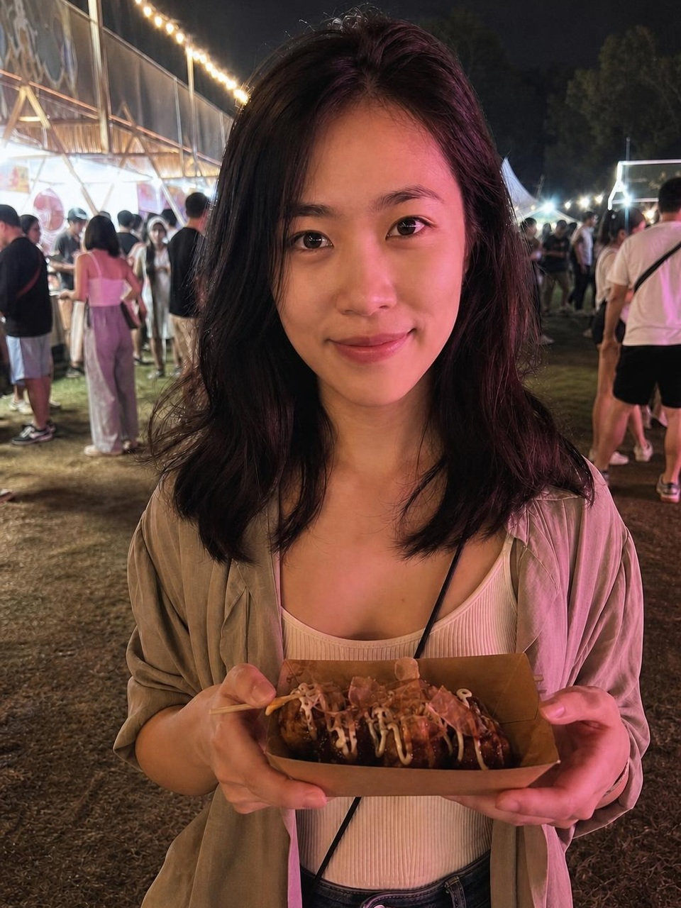

# 真实模型验收结果（2026-08-26）

## 结论

首轮三场景端到端验收通过。测试集全部为仓库内的虚构合成人像，不含真实用户照片。

| 指标 | 结果 | 门槛 |
|---|---:|---:|
| 有效结果率 | 100%（3/3） | ≥ 80% |
| 不合格结果展示率 | 0% | = 0% |
| 端到端耗时 P50 | 42.44 秒 | ≤ 90 秒 |
| 端到端耗时 P95 | 46.62 秒 | ≤ 180 秒 |

同一三图固定集的优化前运行与优化后运行对比：P50 从 78.57 秒降至 42.44 秒，下降 46.0%；第一候选可交付率从 33.3%（1/3）提升到 100%（3/3）；生成候选数从 5 张降至 3 张。不合格结果展示率始终为 0。

### Brief 核心指标对照

| Brief 指标 | 实测 | 门槛 | 判定 |
|---|---:|---:|---|
| 全流程 P50 降幅 | 46.0% | ≥ 30% | 通过 |
| 第一候选可交付率 | 100%（3/3） | ≥ 70% | 通过 |
| 最多两轮纠偏后可交付率 | 100%（基础 3 组 + V2/V3 3 组） | ≥ 95% | 通过 |
| 原图回退率 | 0% | ≤ 5% | 通过 |
| V2/V3 反馈执行正确率 | 100%（3/3） | ≥ 90% | 通过 |
| 硬失败候选展示率 | 0% | = 0% | 通过 |

这些百分比来自 3 张固定合成人像，足以作为工程回归门，但样本量不足以代替真人产品统计。后续每次换模型、提示词或阈值都必须用相同脚本重跑。

本次 Gemini 测试账户因预付额度不足触发了受控降级，三张图片均由 `gpt-image-2` 完成编辑，`gpt-4.1` 执行高精度质量裁判。该降级只处理额度、限流和服务不可用，不绕过安全策略错误。

## 分场景结果

| 场景 | 身份 | 目标变化 | 锁定区 | 画幅 | 耗时 | 结果 |
|---|---:|---:|---:|---:|---:|---|
| 复杂夜景女性 | 96 | 68 | 97 | 98 | 47.08 秒 | 通过 |
| 车内日光男性 | 98 | 70 | 98 | 98 | 41.94 秒 | 通过 |
| 侧转窗边女性 | 97 | 67 | 98 | 98 | 42.44 秒 | 通过 |

三张结果的颧骨安全分均为 97–98，脸宽安全分均为 97–98，硬失败码均为空。

## V2/V3 三图验收

V2/V3 对每个场景同时提交原图、上一版和新反馈，并由独立三图裁判检查反馈执行、身份、锁定区和原图基线。

| 场景 | 反馈执行 | 身份 | 锁定区 | 原图基线 | 结果 |
|---|---:|---:|---:|---:|---|
| 复杂夜景：加强下颌、锁定五官 | 92 | 96 | 97 | 95 | 通过 |
| 车内日光：加强衔接、五官恢复原图 | 95 | 95 | 95 | 95 | 通过 |
| 侧转窗边：只加强可见侧 | 92 | 90 | 95 | 92 | 通过 |

V2/V3 反馈执行正确率 100%（3/3），两轮内可交付率 100%，原图回退率 0%，每组均为第一候选直接通过。
逐项机器可读结果见 [revision-report.json](acceptance-assets/20260826/revision-report.json)。

| 原图 | V1 | V2 |
|---|---|---|
|  |  |  |
|  |  |  |
|  |  |  |

### 复杂夜景女性

| 原图 | 结果 |
|---|---|
|  |  |

### 车内日光男性

| 原图 | 结果 |
|---|---|
|  |  |

### 侧转窗边女性

| 原图 | 结果 |
|---|---|
|  |  |

## 复现

按 README 的真实模型验收命令运行。原始 JSON/HTML 报告默认写入被 Git 排除的 `backend/acceptance_runs/`，避免把临时运行产物或本机路径提交到仓库。

本报告是固定合成测试集的小样本工程验收，不替代产品上线后的真人盲测。Brief 中“小规模人工盲测”仍应由产品方使用已获授权的真人素材完成；本仓库不接收或提交真人照片。
