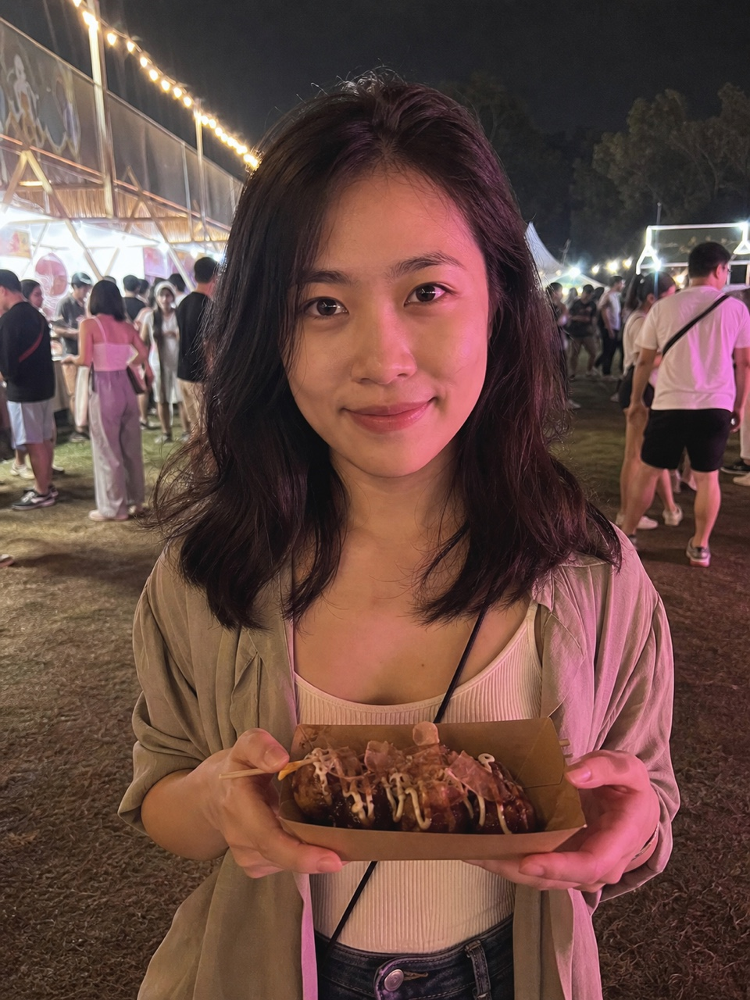
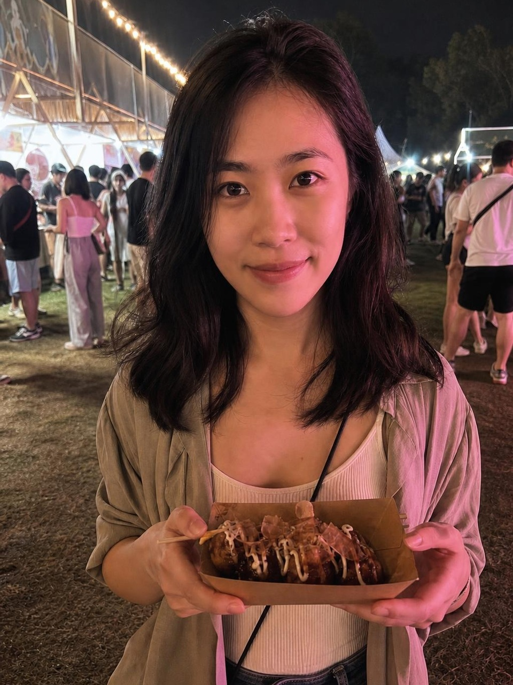
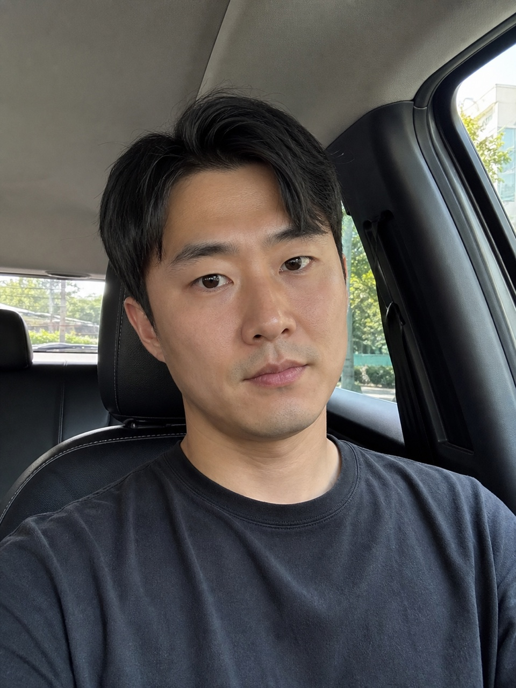

# 真实模型验收结果（2026-08-26）

## 结论

首轮三场景端到端验收通过。测试集全部为仓库内的虚构合成人像，不含真实用户照片。

| 指标 | 结果 | 门槛 |
|---|---:|---:|
| 有效结果率 | 100%（3/3） | ≥ 80% |
| 不合格结果展示率 | 0% | = 0% |
| 端到端耗时 P50 | 42.44 秒 | ≤ 90 秒 |
| 端到端耗时 P95 | 46.62 秒 | ≤ 180 秒 |

本次 Gemini 测试账户因预付额度不足触发了受控降级，三张图片均由 `gpt-image-2` 完成编辑，`gpt-4.1` 执行高精度质量裁判。该降级只处理额度、限流和服务不可用，不绕过安全策略错误。

## 分场景结果

| 场景 | 身份 | 目标变化 | 锁定区 | 画幅 | 耗时 | 结果 |
|---|---:|---:|---:|---:|---:|---|
| 复杂夜景女性 | 96 | 68 | 97 | 98 | 47.08 秒 | 通过 |
| 车内日光男性 | 98 | 70 | 98 | 98 | 41.94 秒 | 通过 |
| 侧转窗边女性 | 97 | 67 | 98 | 98 | 42.44 秒 | 通过 |

三张结果的颧骨安全分均为 97–98，脸宽安全分均为 97–98，硬失败码均为空。

### 复杂夜景女性

| 原图 | 结果 |
|---|---|
|  |  |

### 车内日光男性

| 原图 | 结果 |
|---|---|
|  |  |

### 侧转窗边女性

| 原图 | 结果 |
|---|---|
|  |  |

## 复现

按 README 的真实模型验收命令运行。原始 JSON/HTML 报告默认写入被 Git 排除的 `backend/acceptance_runs/`，避免把临时运行产物或本机路径提交到仓库。

